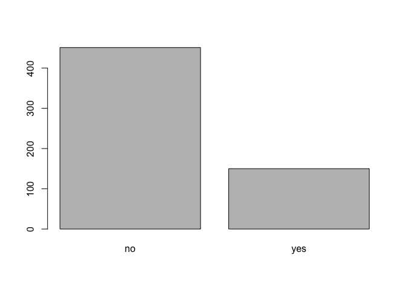
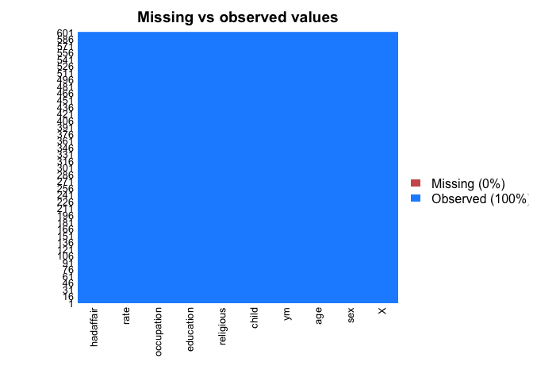

Final Project: Examining Affair Data
================
Nayana Davis

Problem: What factor(s) contribute(s) most strongly to an individual having an extramarital affair?
---------------------------------------------------------------------------------------------------

How did you develop your question and what relevant research has already been completed on this topic?

Infidelity is a topic where people are not exactly going to be the most forthcoming if they're commited the act. As such, I wasn't able to glean much valuable insight on the drivers for extramarital affairs beyond basic demographic markers.

{r} \[NPR reports\] (<https://www.npr.org/2015/07/26/426434619/sorting-through-the-numbers-on-infidelity>) that data from Ashley Madison revealed that men approaching their next decade (ie 29, 39, etc) were more likely to be on the site. {r} \[The General Social Survey\] (<https://ifstudies.org/blog/who-cheats-more-the-demographics-of-cheating-in-america>), conducted by Institute for Family Studies found that Democrats, those who grew up in broken homes, and those who did not attend many religious services where more likely to take part in adultery.

Although, the Extramarital Affairs Data set used in a survey conducted by Yale's Ray C. Fair is older -- 1977, it did provide additional factors that I suspected could contribute to having an extramarital affair, such as rating the participant's happiness in the marriage, if children were involved and years married. This prompted me to wonder if there was a factor evaluated that would allow for prediction of infidelity.

1.  How did you gather and prepare the data for analysis?

As previously mentioned, I used the {r} \[Fairs Extramarital Affairs Data set\] (<https://www.npr.org/2015/07/26/426434619/sorting-through-the-numbers-on-infidelity>) to conduct my analysis. I converted many of the predictor variables into factors from integers since they were categorical and ordinal values. I actually got rid of the affairs column, which reported the number of times a participant had sexual intercourse outside of marriage and instead made a new column called hadaffair, which is set to "yes" if the number in the old affairs column was greater than or equal to 1. I did this because I thought the old column was a strange metric since it doesn't reveal if there were multiple partners or time span -- I believed the new one I created is more straightforward.

Data Processing
---------------

``` r
setwd("/Users/nayanadavis/Desktop/R/Intro to DS/Final Project/")
affair_data <- data.frame(read.csv("./Fair.csv", header = TRUE))
str(affair_data)
```

    ## 'data.frame':    601 obs. of  10 variables:
    ##  $ X         : int  1 2 3 4 5 6 7 8 9 10 ...
    ##  $ sex       : Factor w/ 2 levels "female","male": 2 1 1 2 2 1 1 2 1 2 ...
    ##  $ age       : num  37 27 32 57 22 32 22 57 32 22 ...
    ##  $ ym        : num  10 4 15 15 0.75 1.5 0.75 15 15 1.5 ...
    ##  $ child     : Factor w/ 2 levels "no","yes": 1 1 2 2 1 1 1 2 2 1 ...
    ##  $ religious : int  3 4 1 5 2 2 2 2 4 4 ...
    ##  $ education : int  18 14 12 18 17 17 12 14 16 14 ...
    ##  $ occupation: int  7 6 1 6 6 5 1 4 1 4 ...
    ##  $ rate      : int  4 4 4 5 3 5 3 4 2 5 ...
    ##  $ nbaffairs : int  0 0 0 0 0 0 0 0 0 0 ...

``` r
# added column to say if person had at least one affair
affair_data <- within(affair_data, {
    hadaffair = ifelse(nbaffairs >= 1, "yes", "no")
 })

# removed number of affairs column
affair_data<- affair_data[ -c(10) ]

affair_data$age<- factor(affair_data$age)
affair_data$ym <- factor(affair_data$ym)
affair_data$religious <- factor(affair_data$religious)
affair_data$education <- factor(affair_data$education)
affair_data$occupation <- factor(affair_data$occupation)
affair_data$rate <- factor(affair_data$rate)
affair_data$hadaffair <- factor(affair_data$hadaffair)
```

Exploratory Data Analysis
-------------------------

``` r
str(affair_data)
```

    ## 'data.frame':    601 obs. of  10 variables:
    ##  $ X         : int  1 2 3 4 5 6 7 8 9 10 ...
    ##  $ sex       : Factor w/ 2 levels "female","male": 2 1 1 2 2 1 1 2 1 2 ...
    ##  $ age       : Factor w/ 9 levels "17.5","22","27",..: 5 3 4 9 2 4 2 9 4 2 ...
    ##  $ ym        : Factor w/ 8 levels "0.125","0.417",..: 7 5 8 8 3 4 3 8 8 4 ...
    ##  $ child     : Factor w/ 2 levels "no","yes": 1 1 2 2 1 1 1 2 2 1 ...
    ##  $ religious : Factor w/ 5 levels "1","2","3","4",..: 3 4 1 5 2 2 2 2 4 4 ...
    ##  $ education : Factor w/ 7 levels "9","12","14",..: 6 3 2 6 5 5 2 3 4 3 ...
    ##  $ occupation: Factor w/ 7 levels "1","2","3","4",..: 7 6 1 6 6 5 1 4 1 4 ...
    ##  $ rate      : Factor w/ 5 levels "1","2","3","4",..: 4 4 4 5 3 5 3 4 2 5 ...
    ##  $ hadaffair : Factor w/ 2 levels "no","yes": 1 1 1 1 1 1 1 1 1 1 ...

``` r
head(affair_data)
```

    ##   X    sex age   ym child religious education occupation rate hadaffair
    ## 1 1   male  37   10    no         3        18          7    4        no
    ## 2 2 female  27    4    no         4        14          6    4        no
    ## 3 3 female  32   15   yes         1        12          1    4        no
    ## 4 4   male  57   15   yes         5        18          6    5        no
    ## 5 5   male  22 0.75    no         2        17          6    3        no
    ## 6 6 female  32  1.5    no         2        17          5    5        no

``` r
#check for averages in continous variables, counts for categorical 
summary(affair_data)
```

    ##        X           sex           age            ym      child    
    ##  Min.   :  1   female:315   27     :153   15     :204   no :171  
    ##  1st Qu.:151   male  :286   22     :117   4      :105   yes:430  
    ##  Median :301                32     :115   1.5    : 88            
    ##  Mean   :301                37     : 88   7      : 82            
    ##  3rd Qu.:451                42     : 56   10     : 70            
    ##  Max.   :601                47     : 23   0.75   : 31            
    ##                             (Other): 49   (Other): 21            
    ##  religious education occupation rate    hadaffair
    ##  1: 48     9 :  7    1:113      1: 16   no :451  
    ##  2:164     12: 44    2: 13      2: 66   yes:150  
    ##  3:129     14:154    3: 47      3: 93            
    ##  4:190     16:115    4: 68      4:194            
    ##  5: 70     17: 89    5:204      5:232            
    ##            18:112    6:143                       
    ##            20: 80    7: 13

``` r
plot(affair_data$hadaffair)
```



``` r
# check for missing values
library(Amelia)
```

    ## Loading required package: Rcpp

    ## ## 
    ## ## Amelia II: Multiple Imputation
    ## ## (Version 1.7.5, built: 2018-05-07)
    ## ## Copyright (C) 2005-2018 James Honaker, Gary King and Matthew Blackwell
    ## ## Refer to http://gking.harvard.edu/amelia/ for more information
    ## ##

``` r
missmap(affair_data, main = "Missing vs observed values")
```

 3. How did you select and determine the correct model to answer your question? Since the question I want to answer was if certain factors could predict if a person was going to participate in an extramarital affair not, I thought a logistic regression model would be best. I wanted to know if specific responses could point to infidelity, which, if you've committed the act is just a yes or no answer.

Model Building
--------------

``` r
library(caret)
```

    ## Loading required package: lattice

    ## Loading required package: ggplot2

``` r
trainIndex <- createDataPartition(affair_data$hadaffair, p=.66, list=FALSE,times = 1)

train <- affair_data[trainIndex, ]
test <- affair_data[-trainIndex, ]


hadaffairlogit <- glm(hadaffair~sex+age+ym+child+religious+education+occupation+rate, family = binomial(link = "logit"), data = train)

# Estimate: the log odds amount in which hadaffair would increase if the covariate was one unit higher
# Intercept: values when covariates are all 0
summary(hadaffairlogit)
```

    ## 
    ## Call:
    ## glm(formula = hadaffair ~ sex + age + ym + child + religious + 
    ##     education + occupation + rate, family = binomial(link = "logit"), 
    ##     data = train)
    ## 
    ## Deviance Residuals: 
    ##      Min        1Q    Median        3Q       Max  
    ## -1.77896  -0.74141  -0.41581  -0.09742   2.84501  
    ## 
    ## Coefficients:
    ##             Estimate Std. Error z value Pr(>|z|)    
    ## (Intercept)  5.08924    2.41889   2.104 0.035382 *  
    ## sexmale      0.06629    0.34580   0.192 0.847985    
    ## age22       -4.80942    1.63597  -2.940 0.003284 ** 
    ## age27       -4.48767    1.64482  -2.728 0.006365 ** 
    ## age32       -4.72580    1.67713  -2.818 0.004835 ** 
    ## age37       -5.34425    1.75575  -3.044 0.002336 ** 
    ## age42       -5.19836    1.75715  -2.958 0.003092 ** 
    ## age47       -5.13326    1.92188  -2.671 0.007564 ** 
    ## age52       -4.72582    1.84148  -2.566 0.010279 *  
    ## age57       -6.88987    1.98966  -3.463 0.000535 ***
    ## ym0.417     -0.28957    1.72732  -0.168 0.866867    
    ## ym0.75      -1.57420    1.60089  -0.983 0.325445    
    ## ym1.5       -0.64806    1.26618  -0.512 0.608772    
    ## ym4          0.27693    1.23484   0.224 0.822551    
    ## ym7          1.23203    1.28288   0.960 0.336871    
    ## ym10         2.07154    1.31483   1.576 0.115138    
    ## ym15         1.99452    1.35365   1.473 0.140634    
    ## childyes    -0.25156    0.44153  -0.570 0.568856    
    ## religious2  -1.78723    0.53340  -3.351 0.000806 ***
    ## religious3  -1.27672    0.52382  -2.437 0.014796 *  
    ## religious4  -2.30491    0.53791  -4.285 1.83e-05 ***
    ## religious5  -2.19080    0.64191  -3.413 0.000643 ***
    ## education12 -1.05594    1.43137  -0.738 0.460686    
    ## education14 -0.92061    1.36306  -0.675 0.499421    
    ## education16 -1.14461    1.41206  -0.811 0.417596    
    ## education17  0.16294    1.39882   0.116 0.907267    
    ## education18 -0.30373    1.39167  -0.218 0.827235    
    ## education20 -0.47106    1.44351  -0.326 0.744173    
    ## occupation2  1.88627    1.01029   1.867 0.061895 .  
    ## occupation3  1.33076    0.60829   2.188 0.028692 *  
    ## occupation4  1.30205    0.55102   2.363 0.018129 *  
    ## occupation5  0.20832    0.47752   0.436 0.662658    
    ## occupation6 -0.18881    0.57548  -0.328 0.742849    
    ## occupation7  1.44955    1.00704   1.439 0.150035    
    ## rate2        0.64696    0.79294   0.816 0.414557    
    ## rate3       -0.19531    0.77756  -0.251 0.801675    
    ## rate4       -0.45216    0.76380  -0.592 0.553863    
    ## rate5       -1.13432    0.79402  -1.429 0.153126    
    ## ---
    ## Signif. codes:  0 '***' 0.001 '**' 0.01 '*' 0.05 '.' 0.1 ' ' 1
    ## 
    ## (Dispersion parameter for binomial family taken to be 1)
    ## 
    ##     Null deviance: 445.94  on 396  degrees of freedom
    ## Residual deviance: 350.85  on 359  degrees of freedom
    ## AIC: 426.85
    ## 
    ## Number of Fisher Scoring iterations: 6

``` r
#There was no positive correlation between any of the predictor variables with a low enough p-value that would allow us to reject the null hypothesis

#Kept religion and age since it showed the lowest p-values, indicating we can more confidently reject the null hypothesis. 
hadaffairlogit <- glm(hadaffair~age + religious + rate, family = binomial(link = "logit"), data = train)

summary(hadaffairlogit)
```

    ## 
    ## Call:
    ## glm(formula = hadaffair ~ age + religious + rate, family = binomial(link = "logit"), 
    ##     data = train)
    ## 
    ## Deviance Residuals: 
    ##     Min       1Q   Median       3Q      Max  
    ## -1.5038  -0.7299  -0.5059  -0.2655   2.5933  
    ## 
    ## Coefficients:
    ##             Estimate Std. Error z value Pr(>|z|)    
    ## (Intercept)   3.4212     1.4719   2.324 0.020105 *  
    ## age22        -3.2851     1.3165  -2.495 0.012586 *  
    ## age27        -2.2401     1.2844  -1.744 0.081149 .  
    ## age32        -1.7640     1.2886  -1.369 0.171047    
    ## age37        -2.0789     1.3103  -1.587 0.112595    
    ## age42        -1.8528     1.3224  -1.401 0.161178    
    ## age47        -1.6705     1.4450  -1.156 0.247665    
    ## age52        -1.7367     1.4151  -1.227 0.219710    
    ## age57        -2.8592     1.5067  -1.898 0.057750 .  
    ## religious2   -1.6028     0.4693  -3.415 0.000637 ***
    ## religious3   -1.1101     0.4751  -2.336 0.019472 *  
    ## religious4   -1.8935     0.4750  -3.986 6.72e-05 ***
    ## religious5   -1.8832     0.5717  -3.294 0.000987 ***
    ## rate2         0.1414     0.6622   0.214 0.830915    
    ## rate3        -0.6601     0.6481  -1.018 0.308443    
    ## rate4        -0.9504     0.6259  -1.518 0.128911    
    ## rate5        -1.5701     0.6533  -2.403 0.016256 *  
    ## ---
    ## Signif. codes:  0 '***' 0.001 '**' 0.01 '*' 0.05 '.' 0.1 ' ' 1
    ## 
    ## (Dispersion parameter for binomial family taken to be 1)
    ## 
    ##     Null deviance: 445.94  on 396  degrees of freedom
    ## Residual deviance: 383.42  on 380  degrees of freedom
    ## AIC: 417.42
    ## 
    ## Number of Fisher Scoring iterations: 5

``` r
#Removed age for a stronger model
hadaffairlogit <- glm(hadaffair~religious + rate, family = binomial(link = "logit"), data = train)

summary(hadaffairlogit)
```

    ## 
    ## Call:
    ## glm(formula = hadaffair ~ religious + rate, family = binomial(link = "logit"), 
    ##     data = train)
    ## 
    ## Deviance Residuals: 
    ##     Min       1Q   Median       3Q      Max  
    ## -1.3100  -0.7163  -0.6114  -0.4311   2.2010  
    ## 
    ## Coefficients:
    ##             Estimate Std. Error z value Pr(>|z|)    
    ## (Intercept)  1.17931    0.68683   1.717  0.08597 .  
    ## religious2  -1.42710    0.45098  -3.164  0.00155 ** 
    ## religious3  -0.93037    0.45272  -2.055  0.03987 *  
    ## religious4  -1.69374    0.45693  -3.707  0.00021 ***
    ## religious5  -1.59091    0.54227  -2.934  0.00335 ** 
    ## rate2        0.05745    0.64684   0.089  0.92923    
    ## rate3       -0.71504    0.63229  -1.131  0.25811    
    ## rate4       -1.06781    0.60964  -1.752  0.07985 .  
    ## rate5       -1.81487    0.62581  -2.900  0.00373 ** 
    ## ---
    ## Signif. codes:  0 '***' 0.001 '**' 0.01 '*' 0.05 '.' 0.1 ' ' 1
    ## 
    ## (Dispersion parameter for binomial family taken to be 1)
    ## 
    ##     Null deviance: 445.94  on 396  degrees of freedom
    ## Residual deviance: 401.61  on 388  degrees of freedom
    ## AIC: 419.61
    ## 
    ## Number of Fisher Scoring iterations: 4

``` r
modeloutput <- exp(coef(hadaffairlogit))
modeloutput
```

    ## (Intercept)  religious2  religious3  religious4  religious5       rate2 
    ##   3.2521135   0.2400035   0.3944079   0.1838305   0.2037409   1.0591306 
    ##       rate3       rate4       rate5 
    ##   0.4891717   0.3437616   0.1628594

``` r
library(ResourceSelection)
```

    ## ResourceSelection 0.3-2   2017-02-28

``` r
hoslem.test(train$hadaffair, fitted(hadaffairlogit))
```

    ## Warning in Ops.factor(1, y): '-' not meaningful for factors

    ## 
    ##  Hosmer and Lemeshow goodness of fit (GOF) test
    ## 
    ## data:  train$hadaffair, fitted(hadaffairlogit)
    ## X-squared = 397, df = 8, p-value < 2.2e-16

``` r
pred.model <- predict.glm(hadaffairlogit,test,type='response')
pred.model 
```

    ##          1          3          5         11         13         16 
    ## 0.30600326 0.52784571 0.27631024 0.45255605 0.18551683 0.34625019 
    ##         21         27         28         29         30         47 
    ## 0.11277889 0.08872490 0.18551683 0.17279697 0.30600326 0.08872490 
    ##         58         60         63         64         67         69 
    ## 0.08872490 0.17047807 0.11277889 0.11277889 0.17047807 0.09739858 
    ##         70         71         74         75         82         86 
    ## 0.21155064 0.17279697 0.22627286 0.34625019 0.08872490 0.52784571 
    ##         90         91         96         97        103        105 
    ## 0.30600326 0.17047807 0.09739858 0.56191444 0.08872490 0.17047807 
    ##        107        108        111        112        113        114 
    ## 0.17047807 0.17047807 0.08872490 0.08872490 0.09739858 0.18551683 
    ##        117        119        122        123        128        129 
    ## 0.38770069 0.08872490 0.18551683 0.22627286 0.08872490 0.11277889 
    ##        130        137        138        139        146        147 
    ## 0.11277889 0.11277889 0.21155064 0.08872490 0.52784571 0.17047807 
    ##        150        152        153        154        158        161 
    ## 0.52784571 0.27631024 0.27631024 0.22627286 0.38770069 0.11277889 
    ##        163        165        166        169        170        171 
    ## 0.09739858 0.30600326 0.38770069 0.30600326 0.38770069 0.08872490 
    ##        179        184        186        187        190        192 
    ## 0.22627286 0.08872490 0.08872490 0.17279697 0.34625019 0.17047807 
    ##        193        197        208        209        211        213 
    ## 0.17047807 0.22627286 0.34625019 0.21155064 0.38553825 0.45255605 
    ##        220        223        226        228        229        230 
    ## 0.09739858 0.08872490 0.34625019 0.21155064 0.08872490 0.17279697 
    ##        232        238        239        251        253        254 
    ## 0.08872490 0.09739858 0.17279697 0.22627286 0.08872490 0.17047807 
    ##        256        264        268        270        271        273 
    ## 0.30600326 0.11277889 0.11277889 0.17279697 0.08872490 0.27631024 
    ##        274        277        278        280        291        294 
    ## 0.27631024 0.24478117 0.11277889 0.34625019 0.30600326 0.22627286 
    ##        296        297        300        302        304        306 
    ## 0.27631024 0.08872490 0.18551683 0.11277889 0.17279697 0.21155064 
    ##        312        313        316        318        320        325 
    ## 0.08872490 0.09739858 0.08872490 0.21155064 0.17047807 0.11277889 
    ##        327        328        330        332        333        336 
    ## 0.30600326 0.11277889 0.22627286 0.17047807 0.17047807 0.38770069 
    ##        339        343        344        346        348        351 
    ## 0.17279697 0.21155064 0.11277889 0.17047807 0.38553825 0.11277889 
    ##        352        354        355        356        362        363 
    ## 0.17279697 0.08872490 0.08872490 0.11277889 0.09739858 0.18551683 
    ##        367        368        369        371        372        373 
    ## 0.08872490 0.08872490 0.52784571 0.38770069 0.41237573 0.11277889 
    ##        377        378        381        383        389        390 
    ## 0.17279697 0.30600326 0.34625019 0.08872490 0.11277889 0.30600326 
    ##        391        393        397        403        407        412 
    ## 0.09739858 0.57600234 0.34625019 0.18551683 0.21155064 0.11277889 
    ##        413        415        420        431        433        434 
    ## 0.22627286 0.17279697 0.08872490 0.21155064 0.17047807 0.09739858 
    ##        441        443        451        453        454        455 
    ## 0.38553825 0.30600326 0.21155064 0.17279697 0.41237573 0.57600234 
    ##        457        461        463        468        469        471 
    ## 0.11277889 0.38770069 0.30600326 0.27631024 0.17279697 0.09739858 
    ##        474        475        476        478        479        483 
    ## 0.30600326 0.38770069 0.17047807 0.45255605 0.17047807 0.09739858 
    ##        486        488        491        492        495        496 
    ## 0.21155064 0.11277889 0.27631024 0.17279697 0.17279697 0.08872490 
    ##        497        502        503        504        508        511 
    ## 0.37415420 0.21155064 0.21155064 0.11277889 0.30600326 0.30600326 
    ##        516        517        518        537        539        540 
    ## 0.17047807 0.52784571 0.38770069 0.45255605 0.38770069 0.21155064 
    ##        544        545        546        547        553        559 
    ## 0.08872490 0.45255605 0.24478117 0.56191444 0.17047807 0.77499841 
    ##        567        574        575        577        578        580 
    ## 0.38553825 0.34625019 0.17047807 0.21155064 0.17047807 0.38553825 
    ##        583        584        585        587        597        601 
    ## 0.30600326 0.27631024 0.57600234 0.34625019 0.34625019 0.17279697

1.  What predictions can you make with your model?

I wasn't able to find any factors that positively correlate with extramarital activity. The p-values rendered the majority of the factor variables nonsignificant. However, I did find that those identifying as more religious and more unhappy in the marriage are predictors for not having an extramarital affair. Even though I wasn't able to answer my question directly, but I was able to see that there are factors that contribute to not committing adultery.

1.  How reliable are your results?

My goodness of fit test revealed a very low p-value showing evidence of poor fit.

1.  What additional information or analysis might improve your model results or work to control limitations?

I'm not sure that I accounted for the for ordinal values appropriately. I think I should have accounted for the fact that the number values are signficant.
